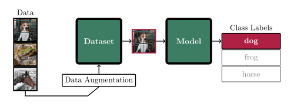

<div align="center">
  <h1>Pixel Animal ML</h1>
  <h4>"Animal Image Classification"</h4>
  
</div>

## About
This is the project repository for the joint assignment of the courses "Image-Processing Systems; Capture and Analysis" (702303_25S) and "Modelling, System/Process Analysis, Forecasting Models and Decision Support" (702403_25S) at the University of Veterinary Medicine, Vienna.
The task is to fill the blank code snippets of each task file.

## Setup and Installation
1. Download or clone this repository:
```bash
git clone git@github.com:gartenschlaefer/pixel_animal_ml.git
```

2. Create a virtual environment for python and activate it:
```bash
python -m venv "path/to/your/environment"
source "path/to/your/environment/bin/activate"
```

3. Go to the project folder and install requirements:
```bash
cd pixel_animal_ml
pip install -r requirements.txt
```

## Usage
Read the assignment sheet `assignment.pdf`.
Only modify and run each task file as requested, e.g.:
```bash
python task0_start_here.py
```